

  

### Blood Sprays & Spatters
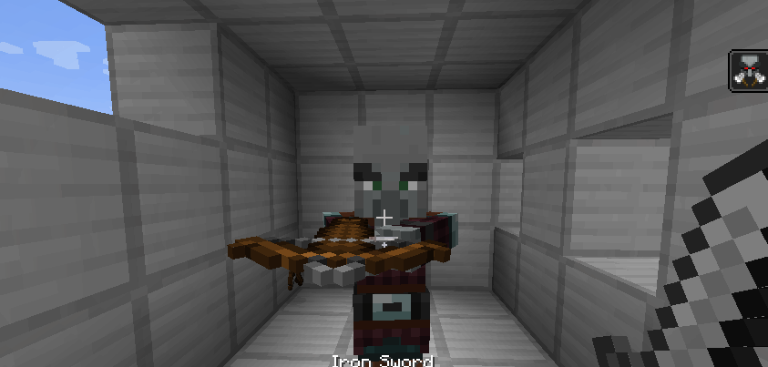
When an entity is attacked, it will produce a certain amount blood spray particles at a certain velocity depending on 
attack damage. These particles will spatter onto almost all surfaces regardless of shape.

### Blood Mist
When an entity is hit by a certain damage type (By default, this is arrows with mod support for TACZ and Scorched Guns),
they will produce a blood mist. The size of the mist is configurable, and if the killing blow is dealt with a blood mist
damage type then the mist produced will be double the size. I was looking into some more realistic war movies, and how
[BlockFront](https://www.curseforge.com/minecraft/mc-mods/blockfront-world-war-ii) implements their blood, and wanted
to emulate something similar.
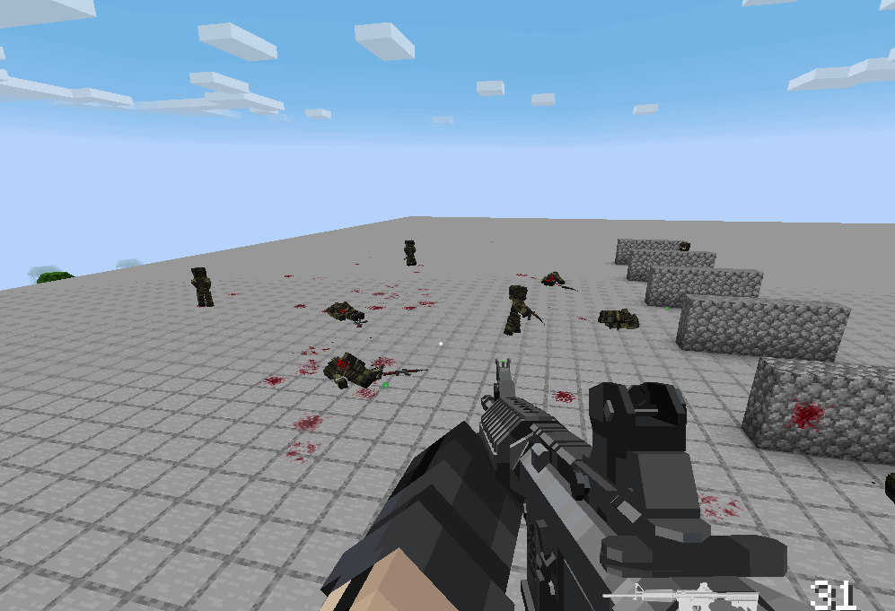
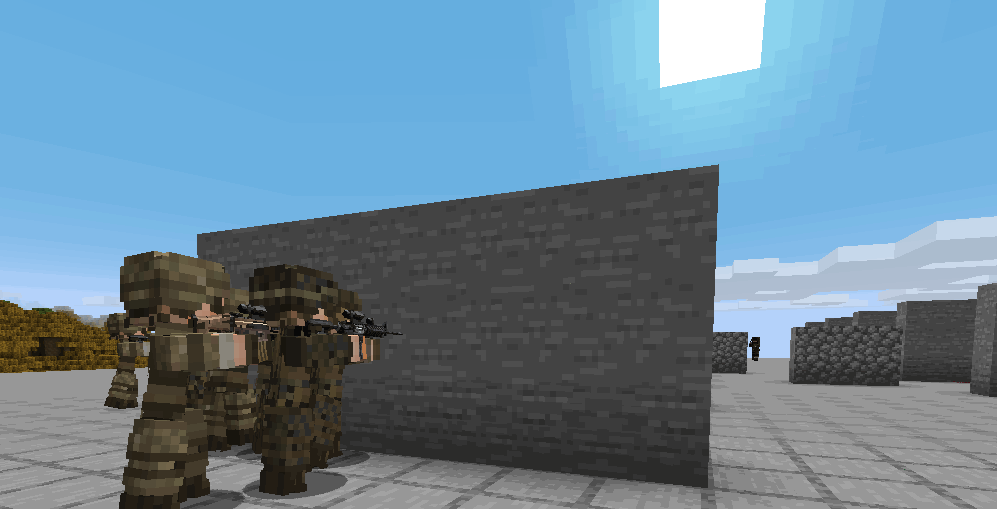
Most of the (1.20.1 - Forge) mods used in the above gifs:
- [TaCZ](https://www.curseforge.com/minecraft/mc-mods/timeless-and-classics-zero)
- [TaCZ: Simple Enemy](https://www.curseforge.com/minecraft/mc-mods/tacz-simple-enemy)
- [Ragdollified](https://www.curseforge.com/minecraft/mc-mods/ragdollified)
- [No Hurt Flash](https://www.curseforge.com/minecraft/mc-mods/no-hurt-flash-reforged)
- [No Poof](https://www.curseforge.com/minecraft/mc-mods/no-poof)

### Blood Drip
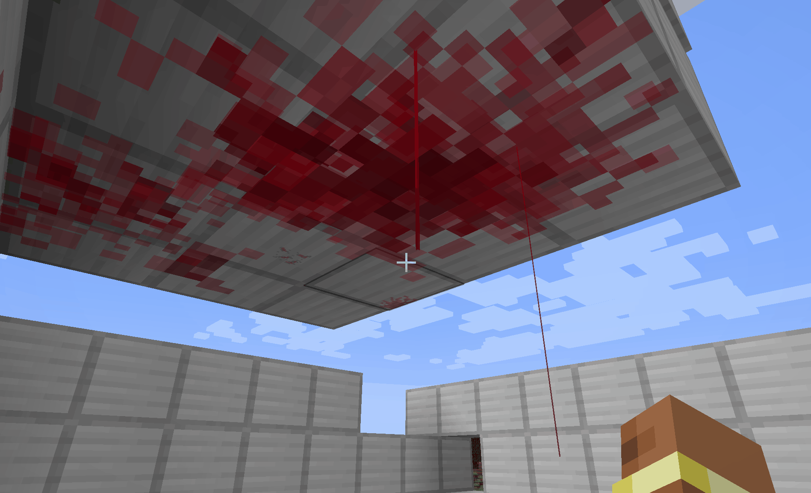
The blood spatters will also
**drip** at random intervals if on a ceiling.

### Data Driven Blood Color Types
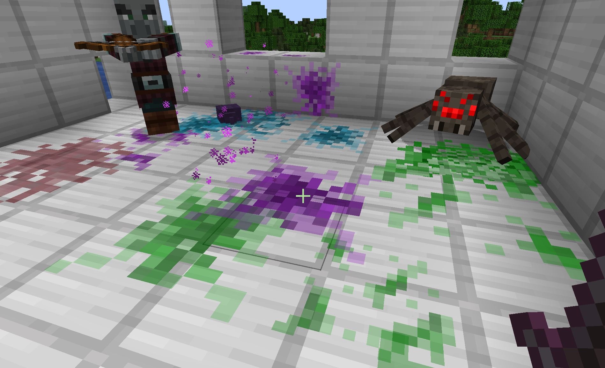

Datapacks can dictate what color entities bleed (or if they bleed at all) based on a hex code value. This 
[website](https://htmlcolorcodes.com/color-picker/) can help with determining a custom blood color.

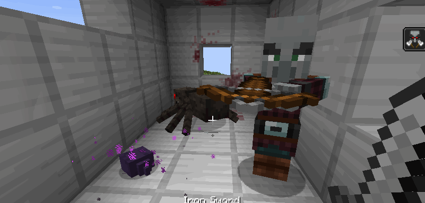

### In Game Configs
Using Neoforge's in-game config menu system, you're now able to edit config values without having to open up the actual
file in the config directory.

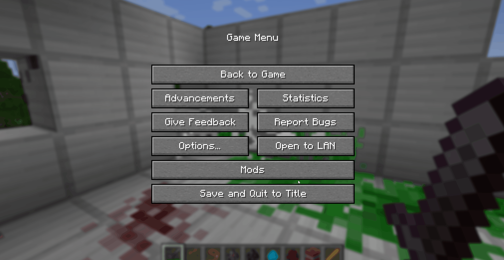

In the **Client Config** you can set things like the **Blood Spatter Lifetime** and the **Blood Spatter Sound Volume**.

In the **Common Config** you can blacklist certain damage sources from causing bleed damage to any entities. I've
already included most sources that wouldn't make sense to cause bleeding such as **onFire** and **starve**, but if I
missed any, then players can easily add the source to the list if they desire.

### Editing Blood Color Types
To edit the blood color types, simply add a custom datapack to override the mod's existing one 
(I will provide a copy of the existing datapack for players to download). The datapack consists of two folders:
`blood_colors` and `tags`.

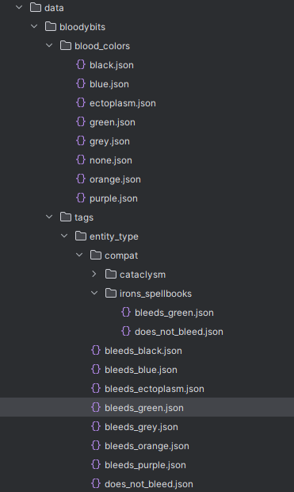

The `blood_colors` folder contains a list of JSON files. The names of these files don't matter. Each file simply 
contains a JSON object that has two properties: `entity_tag` and `color`. The `entity_tag` will references the desired 
JSON file in the `tags/entity_types` directory. The `color` property will reference the desired hex code color value 
that you want the entities to bleed.

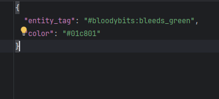

The `tags` folder contains a subfolder `entity_types`. This is a built-in Minecraft structure that allows us to add 
certain tags to entities for reference. Here, we simply create the JSON file that will act as the tag's name, and 
populate it with a list of entities that we want this tag to apply to.

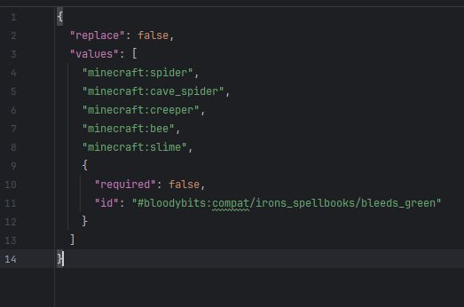

Above is an example of the JSON file `bleeds_green.json`, which you will notice is the one that is referenced in the 
`blood_colors/green.json` file's `entity_tag` property. In this file, there are only two properties, but a lot of 
content since this is where the list of entities will be set. 

- The `replace` property simply tells the game that this datapack
will, or will not, be replacing any preexisting data with this data. Since this is an entirely new tag that I am adding
to these entities, I set this value to `false`, but if a datapack were made to override this one, then it would be set 
to `true`.
- The `values` property will contain a list of all the entities that this tag should apply to. As well, JSON objects
can be added to this list. These are denoted by the opening and closing curly braces `{}`. In here there the property
`required` property determines if this object ID is required for the tag to load successfully. I'm using these objects
as optional references to mod entities, so I set those properties as `false`. The `id` property references another file
location that will contain the modded entities that I want this tag to apply to.

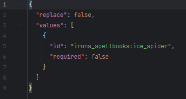

Above is an example of a mod's entity that a tag should apply to.

### Supported Mods By Default
- Iron's Spells & Spellbooks
- L_Ender's Cataclysm

### NOTE:
With future updates I will add more mod compats to the base datapack of Bloody Bits. If you have a specific mod that 
you would like added, just let me know, and I'll see if I can get it added in! If I can't, then it's fully possible to
add them in yourself via a custom datapack.